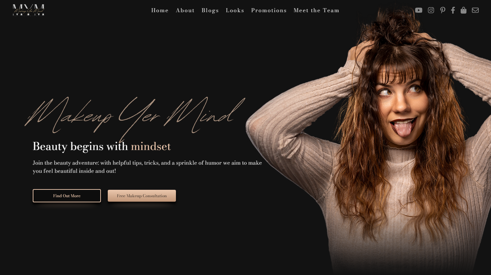
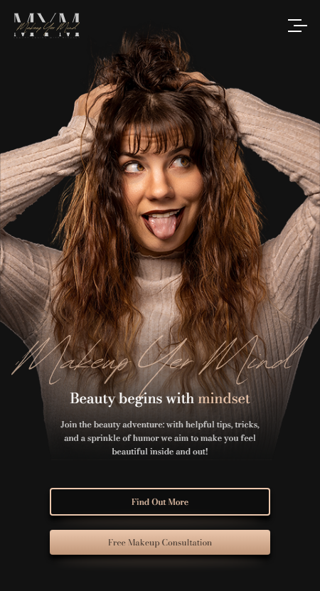
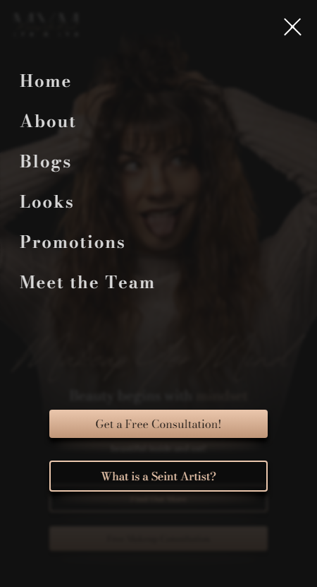

# Makeup Yer Mind - Blog and Multimedia Platform

A production blog application built from the ground up with Next.js designed to interface with a custom content management system. This site was built according to a very specific list of requirements from my client with the intent to maximize SEO and User Experience.

Visit this site [here](https://makeupyermind.com)

*This demonstration is being done with the permission of the client. All sensitive information has been removed.*

## Table of Contents

- [Overview](#overview)
    - [Screenshots](#screenshots)
    - [Requirements](#requirements)
- [The Process](#the-process)
    - [Design](#design)
    - [Organization and Routing](#organization-and-routing)
    - [API Structure](#api-structure)
    - [Database](#database)
- [Continued Development](#continued-development)
- [Author](#author)

## Overview

### Screenshots

Landing Page - Desktop

Landing Page - Mobile + Menu

### Requirements

The client requested a complete overhaul of their existing blog site to include a new, modern design, easier content delivery/management, and improved SEO. I included my own requirements for every site I build, which include a very detailed and responsive design as well as a fast and enjoyable user experience. I also worked with the client to improve and expand their current content to better organize and distribute different forms of content (and also make their life a little easier).

To summarize, this application needed to:

- Be designed with the purpose of converting more visitors to purchase products through the client's affiliate member page
- Organize content in an intuitive and easily-consumable fashion
- Optimize search engine performance to reach a larger audience and appear in more search results
- Automate as much of the content delivery process as possible to allow more content to be delivered more consistently

## The Process

In order to meet all project requirements and maintain an aesthetically pleasing and high performance application, I chose to build this app with Next.js to incorporate speed and SEO into a true full-stack application.

### Design

### Organization and Routing

### API Structure

### Database

## Continued Development

As the client's business evolves, this application will too. Future developments include a user-authenticated member section where users can interact in a real-time chat room with 'parties' hosted by the client for special promotional events and sales.

Additionally, as the user feedback is received over time the design will be refined and improved to include smoother animations and transitions between pages and on interaction points to provide an even smoother and more enjoyable user experience.

## Author

- Visit my portfolio - [ryanbradleyportfolio.com](https://ryanbradleyportfolio.com)
- Contact me for your next website - [ryanbradleywebdev.com](https://ryanbradleywebdev.com)
- Email me - [ryan@ryanbradleywebdev.com](ryan@ryanbradleywebdev.com)
- Follow my Instagram - [@ryanbradley_web_dev](https://www.instagram.com/ryanbradley_web_dev/)