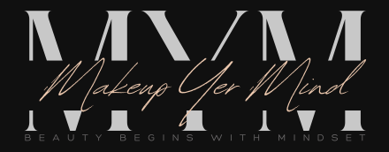
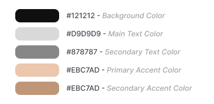
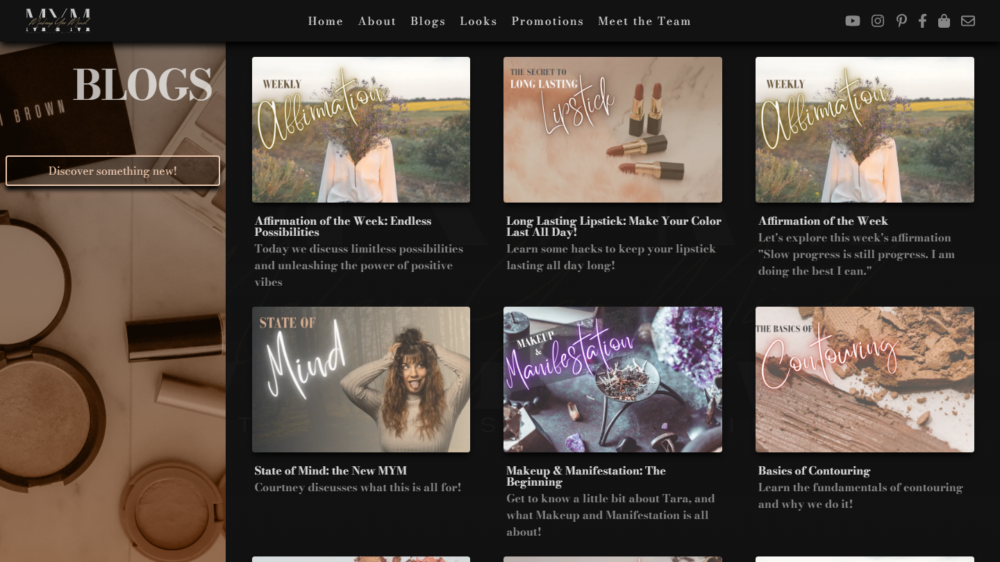
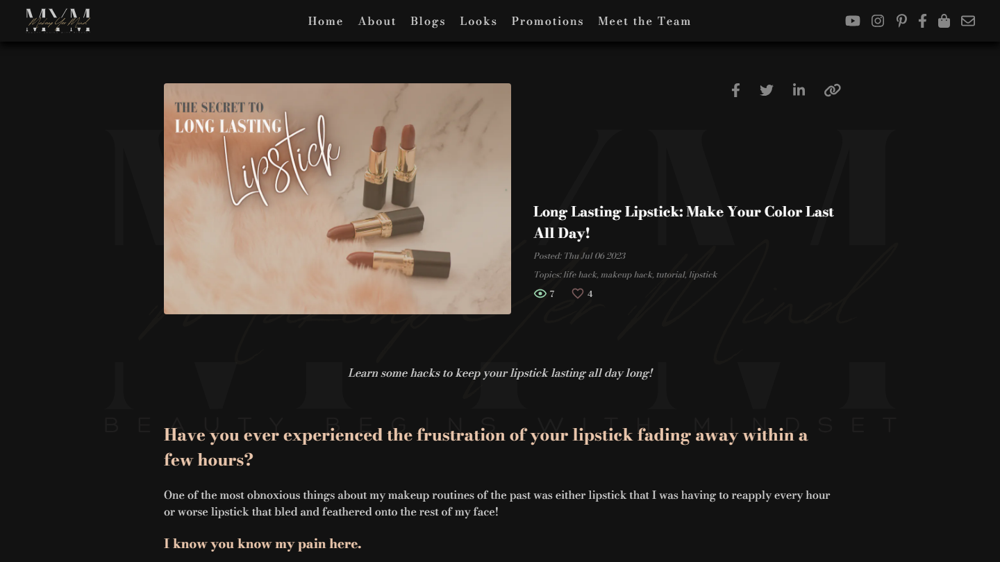
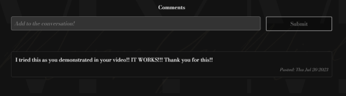
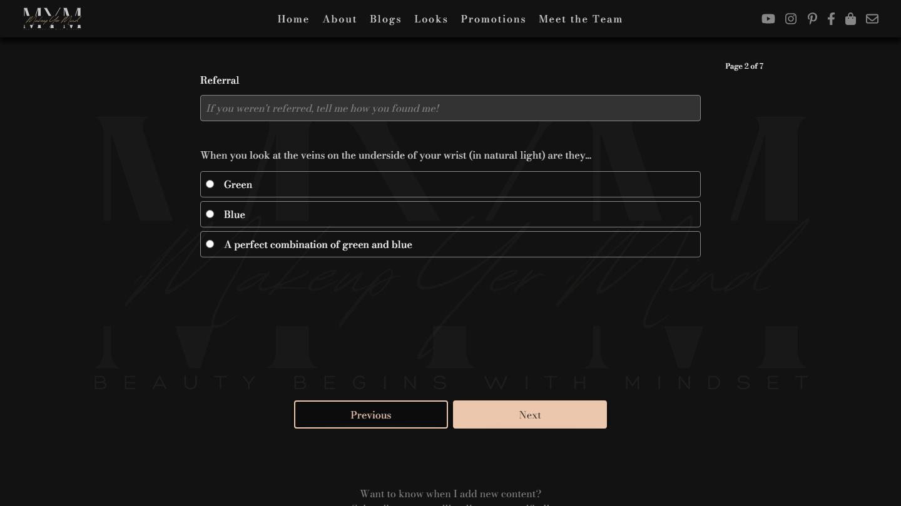
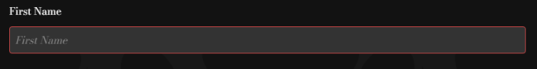

# Makeup Yer Mind - Blog and Multimedia Platform

A production blog application built from the ground up with Next.js designed to interface with a custom content management system. This site was built according to a very specific list of requirements from my client with the intent to maximize SEO and User Experience.

Visit this site [here](https://makeupyermind.com)

*This demonstration is being done with the permission of the client. All sensitive information has been removed.*

## Table of Contents

- [Overview](#overview)
    - [Screenshots](#screenshots)
    - [Requirements](#requirements)
- [The Process](#the-process)
    - [Design](#design)
    - [Major Features](#major-features)
    - [Organization and Routing](#organization-and-routing)
    - [API Structure](#api-structure)
    - [Database](#database)
- [Continued Development](#continued-development)
- [Author](#author)

## Overview

### Screenshots

Landing Page - Desktop

Landing Page - Mobile + Menu

### Requirements

The client requested a complete overhaul of their existing blog site to include a new, modern design, easier content delivery/management, and improved SEO. I included my own requirements for every site I build, which include a very detailed and responsive design as well as a fast and enjoyable user experience. I also worked with the client to improve and expand their current content to better organize and distribute different forms of content (and also make their life a little easier).

To summarize, this application needed to:

- Be designed with the purpose of converting more visitors to purchase products through the client's affiliate member page
- Organize content in an intuitive and easily-consumable fashion
- Optimize search engine performance to reach a larger audience and appear in more search results
- Automate as much of the content delivery process as possible to allow more content to be delivered more consistently

## The Process

In order to meet all project requirements and maintain an aesthetically pleasing and high performance application, I chose to build this app with Next.js to incorporate speed and SEO into a true full-stack application.

### Design

For the design of this site, I was given a logo around which to design the entire layout and color scheme. Using this logo, and slightly altering the colors used, I derived a main color scheme using a primary, secondary, and accent color keeping in mind the 60-30-10 rule of color theory.

With this palette derived, I designed the home page with the intent to capture visitor attention and display the various forms of content according to heirarchy. The latest blog is displayed first, followed by promotional content and the 'Looks to Try' section, which are smaller and more easily-consumed pieces of content.

The entire application is based around a grid concept to provide a flexible and pleasing user interface, prioritizing the newest articles and promotional content. With responsive design in mind, these grids can grow and shrink according to screen size and ensure a consistent layout regardless of the device on which the user is viewing it.

The other major portion of the design revolved around the blog articles, which I designed to maintain white space on larger screen sizes but overall be simple and straight-forward. Each article is composed of the main article content, a title, description, image, and topics (used for search and filtering). Also included is a 'like' feature where users can like the article, and an 'article views' display. These are displayed at the head and foot of the article, along with a social media sharing feature.

### Major Features

This site required a great deal of user interactivity, including commenting on and liking blog articles, submitting consultation request forms, and subscribing to mailing lists. For SEO each article post will generate an opengraph image and social media sharing thumbnail based on the article content. For 'looks to try' articles, which included two images, this required an API route to construct an Image using Next.js ImageResponse API.

#### Article Comments

Comments are implemented by a simple form component attached to each article. When a user submits a comment, the UI changes to show that it is being submitted, and then either a success or failure message will be shown. On submission to the database, the component is subscribed to changes and then updates comments on the page, allowing the user to immediately see their comment posted. On successful submission the comment form is disabled to prevent spamming attempts, but on page refresh it will be reset to allow multiple comments from legitimate users.

#### Consultation Request Form

This feature was built to move the client's existing consultation form off of Jotform and integrate it into the associated content management system. This form allows users to submit some basic information and a 'selfie' so the client can provide advice and guidance for their makeup and skincare routine. It was important to make this form fluid, intuitive, and interactive. It also required conditional rendering for a 'yes/no' option for the user to opt into having an account made for them on an affiliate site by the client on their behalf.

On submission of the form, a form validation method is run to ensure all required information is supplied. This method iterates through the form state and, if any required information is not supplied, it navigates to that form page and sets an 'invalid' class to that input.

/app/makeup-consultation/components/Form.tsx:93
~~~
const validateForm = () => {
    formRef.current?.querySelectorAll<HTMLInputElement | HTMLTextAreaElement>('input, textarea').forEach(field => {
        if (!field.value) {
            field.style.borderColor = 'var(--color-invalid)'
        }
    })

    validateVeinColor()
    validateSelfie()

    if (!formData.firstName || !formData.lastName || !formData.email) {
        return setFormPage(2)
    }

    if (!formData.referral || !formData.veinColor) {
        return setFormPage(3)
    }

    if (!formData.coverage) {
        return setFormPage(4)
    }

    if (!selfieFile) {
        return setFormPage(6)
    }

    if (seintCartWanted && (!formData.address || !formData.phone)) {
        return setFormPage(7)
    }
}
~~~

Each input also has its own validation method that is called on change, so an invalid input can be revalidated after entering the appropriate information.

#### Opengraph Images

Each article generates page metadata based on the page content. For blogs and promotions, which only use one image, this process is accomplished by an exported 'generateMetadata' function:

/app/blogs/[slug]/page.tsx:25
~~~
export async function generateMetadata(
    { params }: Params
): Promise<Metadata> {
    const slug = params.slug;

    const blog = await getBlogBySlug(slug)

    const metadata = {
        title: blog?.title || 'Blog not found',
        descrition: blog?.description || 'No description found',
        openGraph: {
            images: [] as string[],
            description: blog?.description
        }
    }

    if (blog) {
        metadata.openGraph.images.push(blog.image)
    }

    return metadata
}
~~~

For 'looks to try' articles, this process is more involved as it requires pushing two images into one. This was accomplished by writing an API route to handle the image generation via the Next.js ImageResponse API:

/app/api/looks/og/route.tsx:6
~~~
export async function GET(request: NextRequest) {
    try {
        const { searchParams } = new URL(request.url)

        const slug = searchParams.get('slug')

        if (!slug) {
            return NextResponse.json({
                error: 'No Image'
            }, {
                status: 400
            })
        }

        const look = await getLookBySlug(slug)

        if (!look) {
            return NextResponse.json({
                error: 'Look not found'
            }, {
                status: 404
            })
        }

        return new ImageResponse(
            (
                

                    
                    
                

            )
        )
    } catch (e: any) {
        return NextResponse.json({
            error: 'Failed to generate image'
        }, {
            status: 500
        })
    }
}
~~~

### Organization and Routing

### API Structure

### Database

## Continued Development

As the client's business evolves, this application will too. Future developments include a user-authenticated member section where users can interact in a real-time chat room with 'parties' hosted by the client for special promotional events and sales.

Additionally, as the user feedback is received over time the design will be refined and improved to include smoother animations and transitions between pages and on interaction points to provide an even smoother and more enjoyable user experience.

## Author

- Visit my portfolio - [ryanbradleyportfolio.com](https://ryanbradleyportfolio.com)
- Contact me for your next website - [ryanbradleywebdev.com](https://ryanbradleywebdev.com)
- Email me - [ryan@ryanbradleywebdev.com](ryan@ryanbradleywebdev.com)
- Follow my Instagram - [@ryanbradley_web_dev](https://www.instagram.com/ryanbradley_web_dev/)